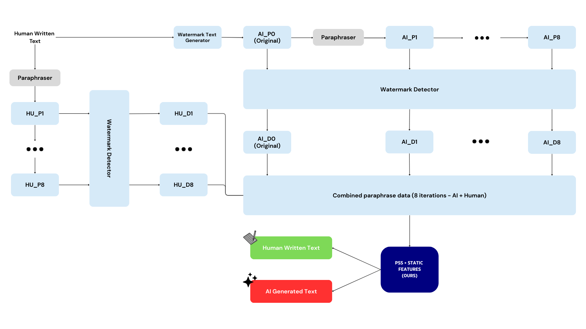

# PSS Watermark Detection
### Paper: <link_here>

This repository contains the implementation of our robust watermark detection method using Paraphrase Stability Scores (PSS) for detecting AI-generated text even after multiple paraphrasing attacks.



## Overview
The PSS (Paraphrase Stability Score) method introduces a novel approach to watermark detection that remains effective even when texts undergo multiple rounds of paraphrasing. By analyzing the stability of watermark signatures across different paraphrasing depths, our method achieves superior robustness compared to traditional detection approaches.

### Key Features

- **Robust Detection**: Maintains high accuracy even after 8+ paraphrasing iterations
- **Complete Pipeline**: End-to-end implementation from dataset creation to final analysis
- **GPU Acceleration**: Optimized for NVIDIA GPUs with CUDA support
- **Resume Capability**: All processing steps support interruption and resumption
- **Modular Design**: Each component can be used independently or as part of the full pipeline

## Installation

### Prerequisites

- Python 3.8 or higher
- CUDA-capable GPU (recommended)
- 64GB RAM (minimum 32GB)
- 100GB free disk space

### Setup
```bash
    # Clone repository
    git clone https://github.com/yourusername/pss-watermark-detection.git
    cd pss-watermark-detection
    
    # Create virtual environment
    python -m venv venv
    source venv/bin/activate  # On Windows: venv\Scripts\activate
    
    # Install dependencies
    pip install -r requirements.txt
    
    # For GPU support with CUDA 11.8
    pip install torch --index-url https://download.pytorch.org/whl/cu118
    
    # For paraphrasing support
    CMAKE_ARGS="-DGGML_CUDA=on" pip install llama-cpp-python
```

## Quick Start
### 1. Dataset Preparation
#### Download and prepare the PG-19 dataset:
```bash
    python scripts/run_dataset_creation.py \
        --config configs/experiment_config.yaml \
        --num-samples 1000 \
        --download
```

### 2. Generate Watermarked Text
#### Apply watermarks to AI-generated text:
```bash
    python scripts/run_watermarking.py \
        --input-csv data/ai_input_text.csv \
        --output-text-csv data/ai_watermarked_text.csv \
        --output-bits-csv data/ai_watermark_bits.csv
```

### 3. Run Complete Pipeline
#### Execute the entire experimental pipeline:
```bash
  python scripts/run_pipeline.py --steps all
```

## Methodology
### Pipeline Components
1. **Watermark Generation:** Text watermarking using vocabulary partitioning (γ=0.25, δ=1.5)
2. **Iterative Paraphrasing:** 8 rounds of paraphrasing using Mistral-7B
3. **Detection:** Extract watermark signatures (D0-D8 files)
4. **PSS Analysis:** Compute stability scores across paraphrasing depths
5. **Classification:** XGBoost classifier combining PSS with static features

## Experimental Setup
* Dataset: PG-19 (1000 samples, 2000 words each)
* Watermarking Model: Llama-2-7B
* Paraphrasing Model: Mistral-7B-Instruct

```commandline
pss-watermark-detection/
|── configs/               # Configuration files
│   ├── experiment_config.yaml
│   └── model_config.yaml
├── data/                  # Dataset storage
├── results/               # Experiment results
├── scripts/               # Execution scripts
├── slurm/                 # Hopper job scripts
├── src/                   # Source code
│   ├── data_preparation/  # Dataset creation
│   ├── watermarking/      # Watermark generation
│   ├── paraphrasing/      # Text paraphrasing  
│   ├── detection/         # Watermark detection
│   └── pss_method/        # PSS implementation
└── README.md
```

## Usage
### Configuration
Modify `configs/experiment_config.yaml` to customize:
* Dataset parameters
* Model configurations
* PSS method parameters
* Output directories

### Running Individual Components
```bash
    # Dataset creation
    python scripts/run_dataset_creation.py --help
    
    # Watermarking
    python scripts/run_watermarking.py --help
    
    # Paraphrasing
    python scripts/run_paraphrasing.py \
        --input-csv data/ai_watermarked_text.csv \
        --output-csv data/ai_paraphrased.csv \
        --text-type ai \
        --iterations 8
    
    # PSS Analysis
    python scripts/run_pss_analysis.py \
        --ai-dir results/detection/ai \
        --human-dir results/detection/human \
        --output-dir results
```

### Acknowledgment
* PG-19 dataset from DeepMind.
* Watermarking implementation based on https://arxiv.org/abs/2301.10226
* Mistral-7B from Mistral AI

